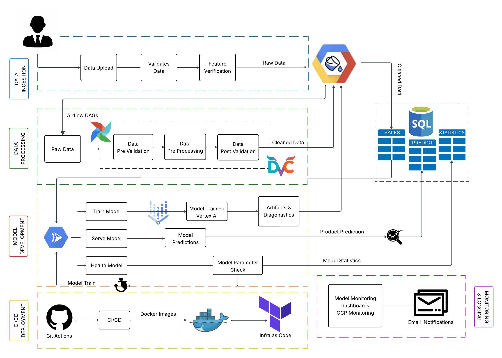

# SupplySense 
## Intelligent Demand Forecasting built for Smarter Supply Chains

Broken forecasts are costing businesses billions.
SupplySense is our response — a full-stack, MLOps-powered demand forecasting platform built to solve the chronic mismatch between supply and actual demand across industries like retail, FMCG, and e-commerce. Traditional ERP systems and manual forecasting methods struggle with real-world volatility like seasonal changes, market shocks, or sudden price wars, leading to over 30% inventory misallocation and $1.8T in annual losses.

Our vision is to enable smarter, real-time forecasting through predictive analytics and intelligent inventory planning. With 90%+ forecast accuracy, we help reduce stockouts by 40% and overstock by 25%. Seamlessly integrating into existing data systems, SupplySense empowers businesses to optimize supply chains at scale — with automation, accuracy, and speed at the core.
Getting Started - Guide
To start working with the project, please follow the setup instructions outlined in the Project Setup Guide.

  

- [Setup Guide](/readme/Setup_Guide.md)
- [Data Pipeline](/readme/DataPipeline.md)
- [Models](/readme/Models.md)
- [Architecture](/readme/Architecture.md)
- [Backend](/readme/Backend.md)
- [Infrastructure](/readme/Infrastructure.md)
- [Frontend](/readme/Frontend.md)

- [Folder Structure](/readme/Folder_Structure.md)

